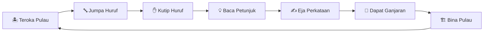
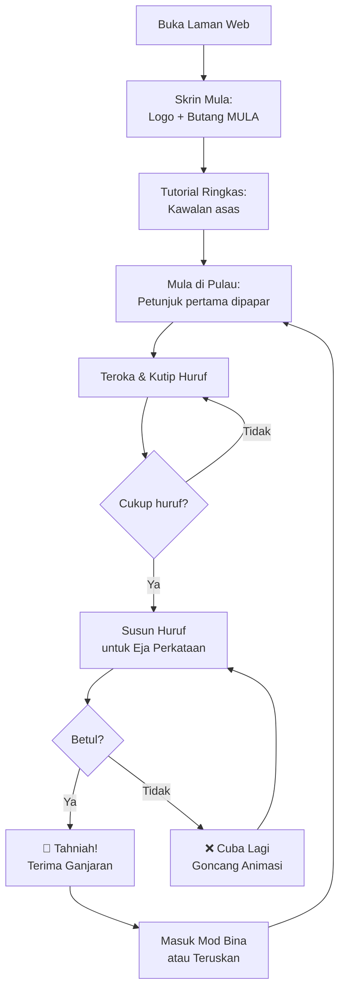
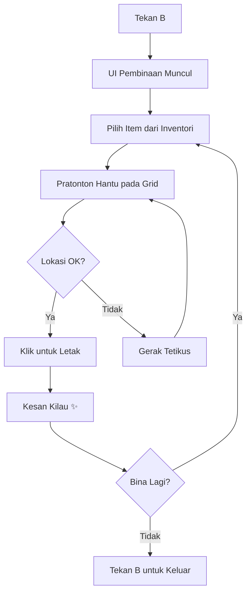

# 📋 PRD: Pulau Kata — 3D Island Word Quest

**Product Name:** Pulau Kata  
**Version:** 1.0  
**Last Updated:** 18 Julai 2026  
**Status:** In Development  
**Platform:** Web Browser (Desktop)  

---

## 1. Ringkasan Eksekutif

**Pulau Kata** ialah permainan 3D berasaskan pelayar web yang menggabungkan penerokaan pulau tropika dengan teka-teki ejaan Bahasa Malaysia. Pemain meneroka sebuah pulau 3D, mengutip huruf-huruf yang terapung, dan mengeja perkataan berdasarkan petunjuk (clue) yang diberikan. Setiap perkataan yang berjaya dieja akan memberi ganjaran item bangunan untuk memperindah dan membina pulau mereka.

Terinspirasi oleh Roblox, permainan ini menggunakan gaya visual low-poly/voxel yang menarik dan interaktif.

---

## 2. Objektif Produk

### 2.1 Matlamat Utama
- Mencipta pengalaman permainan 3D yang menarik dan interaktif di pelayar web
- Menggalakkan pembelajaran dan pengukuhan ejaan Bahasa Malaysia
- Menyediakan mekanik pembinaan kreatif sebagai ganjaran
- Pengalaman bermain tanpa perlu muat turun atau pemasangan

### 2.2 Metrik Kejayaan
| Metrik | Sasaran |
|---|---|
| Masa bermain purata | > 15 minit setiap sesi |
| Kadar penyiapan puzzle pertama | > 90% |
| Kadar kembali bermain | > 40% |
| Prestasi (FPS) | ≥ 30 FPS pada peranti purata |

---

## 3. Pengguna Sasaran

### 3.1 Persona Utama
- **Umur:** 8–16 tahun
- **Bahasa:** Bahasa Malaysia
- **Peranti:** Komputer desktop/laptop dengan pelayar moden
- **Minat:** Permainan Roblox, Minecraft, teka-teki perkataan

### 3.2 Persona Sekunder
- **Guru/Pendidik:** Menggunakan permainan sebagai alat pembelajaran interaktif
- **Ibu bapa:** Mencari permainan pendidikan yang selamat dan menyeronokkan

---

## 4. Ciri-ciri Produk

### 4.1 Kitaran Permainan Teras (Core Game Loop)



### 4.2 Ciri Terperinci

#### P0 — Wajib Ada (MVP)

| # | Ciri | Penerangan |
|---|---|---|
| F1 | **Dunia 3D Pulau** | Pulau tropika dengan pantai, bukit, air, pokok. Dijana secara prosedural menggunakan heightmap. |
| F2 | **Watak Pemain** | Watak blok gaya Roblox dibina dari primitif Three.js. Boleh berjalan, berlari, melompat. |
| F3 | **Kawalan Pemain** | WASD/anak panah untuk bergerak, Space untuk lompat, tetikus untuk pandang sekeliling (pointer lock). |
| F4 | **Kamera Orang Ketiga** | Kamera mengikut pemain dari belakang dengan interpolasi lancar dan kawalan tetikus. |
| F5 | **Sistem Kutipan Huruf** | Huruf 3D terapung di pulau, berputar dan bercahaya. Auto-kutip apabila pemain berdekatan. |
| F6 | **Sistem Teka-teki Ejaan** | Paparan petunjuk (clue) di skrin. Pemain susun huruf yang dikutip untuk mengeja perkataan. |
| F7 | **20 Teka-teki BM** | 20 perkataan Bahasa Malaysia dengan petunjuk, kategori, dan ganjaran unik. |
| F8 | **Sistem Ganjaran** | Setiap perkataan yang betul memberi item bangunan (pokok, pondok, jambatan, dll). |
| F9 | **Mod Pembinaan** | Tekan B untuk masuk mod bina. Letakkan item pada grid. Pratonton hantu sebelum letak. |
| F10 | **Inventori** | Simpan dan papar item yang diperoleh dengan tab kategori. |
| F11 | **HUD Permainan** | Paparan skor, huruf dikutip, petunjuk semasa, bar kemajuan. |
| F12 | **Simpan Permainan** | Auto-simpan ke localStorage setiap 30 saat. |

#### P1 — Penting Tapi Boleh Ditunda

| # | Ciri | Penerangan |
|---|---|---|
| F13 | **Kesan Zarah (Particles)** | Letupan zarah semasa kutip huruf, letak bangunan, dan percikan air. |
| F14 | **Sistem Pembayang** | Pendedahan satu huruf selepas masa tertentu jika pemain tersekat. |
| F15 | **Penilaian Bintang** | ⭐⭐⭐ berdasarkan kelajuan menyelesaikan teka-teki. |
| F16 | **Kitaran Siang/Malam** | Gradien langit dan pencahayaan berubah mengikut masa permainan. |
| F17 | **Pencapaian (Achievements)** | Lencana untuk pencapaian tertentu (kumpul 50 huruf, bina 10 item, dll). |

#### P2 — Bagus Untuk Ada

| # | Ciri | Penerangan |
|---|---|---|
| F18 | **Kesan Pos-Pemprosesan** | Bloom, tone mapping, SSAO untuk visual sinematik. |
| F19 | **Muzik & Bunyi** | Muzik latar tropika, kesan bunyi kutipan huruf dan pembinaan. |
| F20 | **Kawalan Sentuh** | Joystick maya dan butang untuk peranti mudah alih. |
| F21 | **Buka Kawasan Baru** | Level tinggi membuka bahagian baru pulau. |
| F22 | **Papan Pendahulu** | Skor tinggi tempatan. |

---

## 5. Rekabentuk Visual

### 5.1 Gaya Seni
- **Low-poly / Voxel** — Terinspirasi Roblox
- **Palet warna tropika** yang terang dan ceria
- **UI Glassmorphism** — Panel kaca kabur dengan border gradient

### 5.2 Palet Warna

| Elemen | Warna | Hex |
|---|---|---|
| Lautan | Biru Tropika | `#0077B6` |
| Pasir | Kuning Hangat | `#F4D35E` |
| Rumput | Hijau Subur | `#2D6A4F` |
| Langit | Gradien Biru | `#48CAE4` → `#023E8A` |
| Huruf | Cahaya Emas | `#FFD60A` |
| UI Kaca | Kabur Putih | `rgba(255,255,255,0.1)` |
| Aksen | Koral | `#FF6B6B` |
| Teks UI | Putih | `#FFFFFF` |

### 5.3 Tipografi
- **Tajuk:** Font tebal, bergaya permainan
- **UI/HUD:** Sans-serif moden (Inter / Outfit)
- **Huruf 3D:** Geometri teks Three.js dengan material bercahaya

---

## 6. Seni Bina Teknikal

### 6.1 Tumpukan Teknologi

| Teknologi | Kegunaan |
|---|---|
| HTML5 | Struktur halaman, overlay UI |
| CSS3 | Gaya, animasi, glassmorphism |
| JavaScript ES6+ | Logik permainan, pengurusan keadaan |
| Three.js (CDN) | Rendering 3D, pencahayaan, kamera |

### 6.2 Struktur Fail

```
roblox/
├── index.html          ← Struktur halaman + UI overlay
├── index.css           ← Semua gaya (glassmorphism, animasi)
├── game.js             ← Enjin permainan lengkap
├── PRD.md              ← Dokumen Keperluan Produk (ini)
└── README.md           ← Dokumentasi projek
```

### 6.3 Kebergantungan Luaran
- **Three.js** v0.160+ — via CDN (unpkg/cdnjs)
- Tiada pelayan diperlukan — sepenuhnya client-side
- Tiada proses binaan — buka `index.html` terus dalam pelayar

### 6.4 Penyimpanan Data
- **localStorage** untuk simpan permainan
- Data disimpan: posisi pemain, inventori, bangunan diletakkan, puzzle diselesaikan, skor

---

## 7. Kandungan Teka-teki

### 7.1 Senarai 20 Perkataan

| # | Perkataan | Petunjuk | Kategori | Kesukaran | Ganjaran |
|---|---|---|---|---|---|
| 1 | PULAU | Tanah yang dikelilingi air 🌊 | Geografi | Mudah | 3x Pokok Kelapa |
| 2 | BUNGA | Bahagian tumbuhan yang cantik dan berwarna 🌺 | Alam | Mudah | 5x Bunga |
| 3 | RUMAH | Tempat kita tinggal 🏠 | Bangunan | Mudah | 1x Pondok |
| 4 | IKAN | Haiwan yang hidup dalam air 🐟 | Haiwan | Mudah | 2x Kolam |
| 5 | BINTANG | Cahaya di langit malam ⭐ | Angkasa | Mudah | 3x Lampu |
| 6 | PELANGI | Lengkungan warna selepas hujan 🌈 | Alam | Sederhana | 1x Taman |
| 7 | JAMBATAN | Struktur merentasi sungai 🌉 | Bangunan | Sederhana | 1x Jambatan |
| 8 | MERCUSUAR | Menara cahaya panduan untuk kapal 🗼 | Bangunan | Sukar | 1x Mercusuar |
| 9 | LAUTAN | Perairan yang sangat luas | Geografi | Sederhana | 1x Jeti |
| 10 | HUTAN | Kawasan dengan banyak pokok 🌳 | Alam | Mudah | 5x Pokok |
| 11 | BURUNG | Haiwan berbulu yang boleh terbang 🐦 | Haiwan | Mudah | 2x Sarang |
| 12 | PANTAI | Kawasan berpasir di tepi laut 🏖️ | Geografi | Mudah | 3x Payung Pantai |
| 13 | GERBANG | Pintu masuk yang besar dan megah | Bangunan | Sederhana | 1x Gerbang |
| 14 | KHAZANAH | Harta yang tersembunyi 💎 | Misteri | Sukar | 1x Peti Harta |
| 15 | PERAHU | Kenderaan di atas air ⛵ | Kenderaan | Sederhana | 1x Perahu |
| 16 | GUNUNG | Tanah tinggi yang menjulang 🏔️ | Geografi | Sederhana | Buka Kawasan |
| 17 | MAHKOTA | Hiasan kepala raja atau ratu 👑 | Diraja | Sederhana | 1x Patung |
| 18 | TELAGA | Lubang dalam tanah berisi air | Alam | Sederhana | 1x Perigi |
| 19 | BENTENG | Kubu pertahanan yang kukuh 🏰 | Bangunan | Sederhana | 1x Benteng |
| 20 | PERMATA | Batu berharga yang berkilau 💎 | Khas | Sukar | 1x Air Pancut |

### 7.2 Pengedaran Kesukaran
- **Mudah (7):** 4–5 huruf, perkataan biasa
- **Sederhana (9):** 5–7 huruf, perkataan sederhana
- **Sukar (4):** 7+ huruf, perkataan kurang biasa

---

## 8. Aliran Pengguna (User Flows)

### 8.1 Aliran Permainan Pertama



### 8.2 Aliran Mod Pembinaan



---

## 9. Keperluan Bukan Fungsional

| Keperluan | Spesifikasi |
|---|---|
| **Prestasi** | ≥ 30 FPS pada GPU bersepadu |
| **Masa Muat** | < 5 saat pada sambungan 4G |
| **Pelayar** | Chrome 90+, Firefox 90+, Edge 90+, Safari 15+ |
| **Resolusi** | Responsif dari 1024x768 hingga 4K |
| **Tanpa Pelayan** | 100% client-side, tiada backend diperlukan |
| **Penyimpanan** | < 5MB localStorage |
| **Kebolehcapaian** | Teks boleh dibaca, kontras warna mencukupi |

---

## 10. Risiko & Mitigasi

| Risiko | Kesan | Mitigasi |
|---|---|---|
| Prestasi rendah pada peranti lama | Pemain keluar | LOD (Level of Detail), kurangkan zarah, had jarak lukis |
| Teka-teki terlalu sukar | Kekecewaan | Sistem pembayang automatik, kesukaran progresif |
| Kehilangan data simpanan | Pengalaman buruk | Auto-simpan kerap, amaran sebelum padam cache |
| Three.js CDN tidak tersedia | Permainan tidak dimuat | Fallback CDN, versi cached |

---

## 11. Pelan Pembangunan

### Fasa 1 — Asas (Minggu 1)
- [x] PRD & README
- [ ] Struktur HTML & UI
- [ ] Dunia 3D asas (pulau, air, langit)
- [ ] Watak pemain & kawalan

### Fasa 2 — Mekanik Teras (Minggu 2)
- [ ] Sistem huruf 3D
- [ ] Kutipan huruf & HUD
- [ ] Sistem teka-teki ejaan
- [ ] Validasi & ganjaran

### Fasa 3 — Pembinaan (Minggu 3)
- [ ] Mod pembinaan
- [ ] Inventori & kategori
- [ ] Letak & padam item
- [ ] Simpan/muat permainan

### Fasa 4 — Penggilapan (Minggu 4)
- [ ] Kesan zarah & visual
- [ ] Animasi & peralihan
- [ ] Pengoptimuman prestasi
- [ ] Ujian & pembetulan pepijat

---

## 12. Glosari

| Istilah | Definisi |
|---|---|
| **Glassmorphism** | Gaya rekabentuk UI dengan kesan kaca kabur |
| **Heightmap** | Peta ketinggian untuk menjana rupa bumi 3D |
| **LOD** | Level of Detail — kurangkan perincian untuk objek jauh |
| **Pointer Lock** | API pelayar untuk mengunci kursor tetikus |
| **Voxel** | Piksel volumetrik — unit 3D seperti blok Minecraft |
| **HUD** | Head-Up Display — paparan maklumat atas skrin |
| **CDN** | Content Delivery Network — pelayan untuk muat fail luaran |
